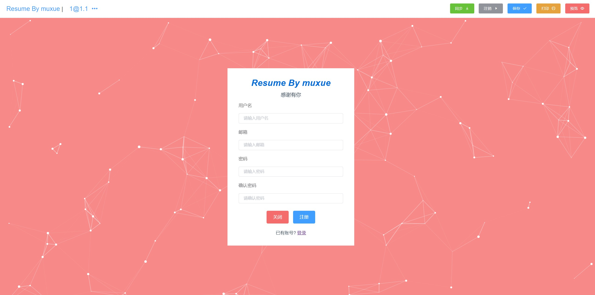
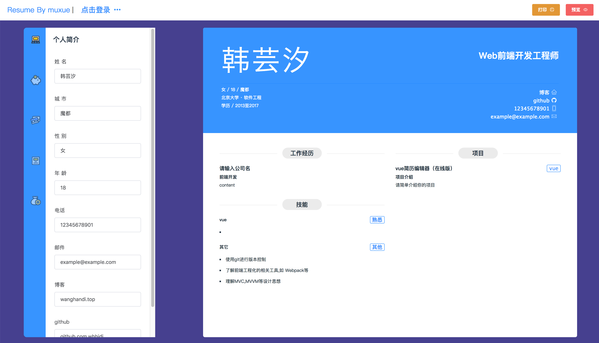

# resume-edit

> A Vue.js project
觉得好用送个小星星呀



#沐雪简历编辑器
## 项目描述
本项目是基于vue开发的在线简历编辑器,初步实现简历编辑,登录,注册等功能
打印生成pdf功能预计2018年7月24日上线,由于使用了elementui的表单,所以本项目未使用vuex
2018.10.18更新：重新设计简历样式，重新优化页面风格，卡哇伊~。删除某个组件，添加新的组件。
优化输入页面和简历的匹配程度。其他细节优化
注意:要填写完整的url(比如：https:github.com/whhjdi)
## 技术要求
1. 使用vue-cli脚手架生成开发环境,使用vue,vue-router,ES6,Scss构建单页面应用
2. 使用Element-ui的部分组件和功能美化页面
3. 使用阿里使用图标库(icon-font)
4. 使用vue-particles展现背景动态效果
5. 使用LeanCloud作为后台数据库,实现登陆注册以及用户信息的保存
6. 采用Element-ui进行前端表单验证
## Tips
1. 点击左侧未登录按钮,弹出登录界面,您可以选择登录或者注册
2. 为方便大家使用,现在不登陆也可以打印了,如果想保存您编辑的内容,则需要注册登录
3. 登陆后,点击同步即可下载云端的数据,修改数据后点击保存即可保存到云端数据库.
4. 若您觉得这个项目对您有帮助,希望能点个小星星,谢谢

## 如何使用
1. 在线使用
2. Build Setup


``` bash
# install dependencies
npm install

# serve with hot reload at localhost:8080
npm run dev

# build for production with minification
npm run build

# build for production and view the bundle analyzer report
npm run build --report
```

For a detailed explanation on how things work, check out the [guide](http://vuejs-templates.github.io/webpack/) and [docs for vue-loader](http://vuejs.github.io/vue-loader).
